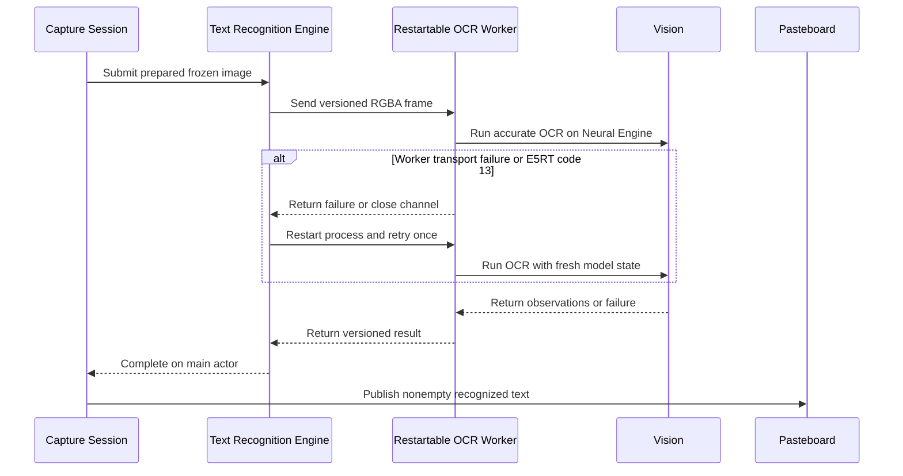

# Workspace Layout Reference

Purpose: Explain the current Rsnap workspace layout, which crate owns which behavior today, and
which directories are source versus generated or runtime-local.

Read this when: You are deciding where a change belongs in the current tree, checking whether the
directory structure still matches the implementation, or routing a documentation or code question
to the right crate or folder.

Inputs: `Cargo.toml`; `README.md`; [`openwiki/spec/capture-session.md`](../spec/capture-session.md);
[`openwiki/spec/platform-host-boundary.md`](../spec/platform-host-boundary.md)

Depends on: [`openwiki/spec/capture-session.md`](../spec/capture-session.md); [`openwiki/reference/host-core-reset.md`](./host-core-reset.md)

Covers: The checked-in workspace layout, crate ownership boundaries today, and the local
directories that should not be treated as repository source.

## Important posture

This document describes the checked-in repository structure today. It is not the architecture
target for the reset lane.

For the active target architecture and migration direction, read:

- [`openwiki/reference/host-core-reset.md`](./host-core-reset.md)
- [`openwiki/spec/platform-host-boundary.md`](../spec/platform-host-boundary.md)
- [`openwiki/decisions/native-host-rust-core-reset.md`](../decisions/native-host-rust-core-reset.md)

## Current top-level layout

| Path | Role |
| --- | --- |
| `native/macos-host/` | SwiftPM AppKit-first macOS host shell: menu bar entry, full-screen capture windows, in-window HUD/toolbar, and native bridging into `rsnap-host-ffi` |
| `apps/rsnap/` | Thin launcher/bootstrap crate: startup logging, build metadata, stable-bundle resolution, and `cargo run -p rsnap` handoff into the staged native macOS host |
| `apps/rsnap-perf/` | Deterministic local performance sweep: fixed fixture construction, checksum-backed correctness checks, case timing, and budget assertions |
| `packages/rsnap-capture-core/` | Durable Rust product-semantics and image-algorithm crate: shared geometry, semantic scene model, host/core protocol enums, reset-native session core, export/crop/PNG encoding, frozen-overlay edit/export, capture-frame rendering, wallpaper thumbnail, minimap, mosaic, selection transform, auto-center, scroll stitching, and live-sample helpers |
| `packages/rsnap-host-ffi/` | Thin C ABI bridge crate used by the native macOS host to call the Rust product core |
| `openwiki/` | OpenWiki OKF v0.1 knowledge root with routing, policy, specifications, runbooks, references, decisions, research provenance, and drift evidence |
| `assets/` | Shared app-icon source plus generated bundle/runtime assets |
| `scripts/` | Packaging helpers plus structured smoke/perf entrypoints under `scripts/smoke/` and `scripts/perf/` |
| `.github/` | CI workflows and repository rules |

This top-level split reflects the durable native-host/Rust-core boundary: Swift owns macOS capture
and presentation authority, `rsnap-capture-core` owns portable product semantics and image
algorithms, and `rsnap-host-ffi` is ABI glue only.

## Crate ownership map

### `apps/rsnap/`

Treat `apps/rsnap/` as the launcher/bootstrap layer for the native host.

It owns:

- app-level logging/bootstrap
- build metadata emission
- stable native-bundle lookup from the current worktree
- fallback handoff into `scripts/build_and_run.sh` when the staged native bundle is missing
- explicit unsupported-platform failure for non-macOS builds

Key paths:

- `apps/rsnap/src/lib.rs`: public runtime entry points for the launcher crate
- `apps/rsnap/src/native_launcher_macos.rs`: staged native-bundle lookup and launch handoff
- `apps/rsnap/src/startup.rs`: startup logging/bootstrap helpers
- `apps/rsnap/src/unsupported_platform.rs`: explicit non-macOS error path

### `apps/rsnap-perf/`

Treat `apps/rsnap-perf/` as the deterministic local performance sweep.

It owns:

- fixed export, capture-frame, frozen-edit, and scroll-capture performance cases
- checksum-backed correctness checks that guard benchmark fixture drift
- deterministic fixture construction under `apps/rsnap-perf/src/fixtures.rs`
- timing and budget result reporting under `apps/rsnap-perf/src/measurement.rs`

Key paths:

- `apps/rsnap-perf/src/main.rs`: perf sweep orchestration plus semantic verification for each
  case family
- `apps/rsnap-perf/src/fixtures.rs`: deterministic fixture, checksum, and expected-value support
- `apps/rsnap-perf/src/measurement.rs`: per-case timing, formatting, and budget enforcement

### `packages/rsnap-capture-core/`

Treat `packages/rsnap-capture-core/` as the new durable product-semantics landing zone.

It owns:

- portable geometry types
- semantic scene snapshots
- explicit host/core protocol enums and structs
- the first reset-native reference session core
- RGBA/BGRA pixel helpers used by host bridge code
- export crop mapping and lossless PNG encoding
- frozen-overlay edit state, export composition, text rendering, and system font fallback selection
- capture-frame layout, background planning, shadowing, wallpaper thumbnail decode/cache, and final
  RGBA composition
- scroll minimap planning
- scroll-capture stitching/session logic, deterministic tests, and the Criterion benchmark target
- mosaic patch generation
- frozen selection hit-testing and transform geometry
- auto-center content-bound detection and margin-balance rules

This crate must stay free of:

- top-level window ownership
- `winit` or `egui` runtime authority
- AppKit ownership
- host-side permission or capture capability code

Key frozen-overlay export paths:

- `packages/rsnap-capture-core/src/frozen_edit.rs`: frozen-overlay edit session state machine,
  including edit geometry, text hit bounds, movement clamping policy, and element models under
  `frozen_edit/elements.rs`
- `packages/rsnap-capture-core/src/frozen_overlay_export.rs`: public frozen-overlay export
  compositor used by `rsnap-host-ffi` and `rsnap-perf`
- `packages/rsnap-capture-core/src/frozen_overlay_export/model.rs`: export element schema shared
  with the FFI decoder and retained frozen edit state
- `packages/rsnap-capture-core/src/frozen_overlay_export/stroke_raster.rs`: deterministic pen,
  arrow, and spotlight border rasterization
- `packages/rsnap-capture-core/src/text_rendering.rs`: text annotation measurement/rasterization
  and font fallback helpers for frozen edit/export
- `packages/rsnap-capture-core/src/system_fonts.rs`: system font discovery and font payload
  selection for Rust text rendering

Key scroll-capture paths:

- `packages/rsnap-capture-core/src/scroll_capture.rs`: scroll-capture session entry with focused
  support modules under `scroll_capture/`
- `packages/rsnap-capture-core/src/scroll_stitching.rs`: public native-host stitching wrapper used
  by `rsnap-host-ffi`
- `packages/rsnap-capture-core/src/scroll_capture/worker_pairwise.rs`: ordered worker-pairwise
  frame registration, committed-frontier catchup, rewind/reacquire handling, and growth-block
  decisions
- `packages/rsnap-capture-core/src/scroll_capture/types.rs`: scroll-capture data model,
  observation outcomes, registration candidates, and telemetry structs shared by the session
  modules
- `packages/rsnap-capture-core/src/scroll_capture/support.rs`: shared pixel matching,
  static-region rejection, image stacking/resizing, and image-analysis helpers used by scroll
  capture
- `packages/rsnap-capture-core/benches/scroll_capture.rs`: deterministic hot-path benchmark target
  for scroll stitching, fingerprinting, overlap matching, and one-step session commit

### `packages/rsnap-host-ffi/`

Treat `packages/rsnap-host-ffi/` as the thin ABI companion to `rsnap-capture-core/`.

It owns:

- opaque session handles for foreign hosts
- FFI-safe config, event, report, scene, request, frozen-overlay, capture-frame, and scroll-capture
  types under the `abi/` module tree
- exported `extern "C"` functions that forward into `rsnap-capture-core`
- the checked-in C header consumed by the native macOS host:
  `packages/rsnap-host-ffi/include/rsnap_host_ffi.h`

It does not own product behavior beyond ABI adaptation.

Key paths:

- `packages/rsnap-host-ffi/src/abi.rs`: ABI constants plus the canonical re-export surface
- `packages/rsnap-host-ffi/src/abi/handles.rs`: opaque Rust-owned handles for foreign callers
- `packages/rsnap-host-ffi/src/abi/geometry.rs`: shared FFI-safe geometry, RGB, and owned-buffer
  payloads
- `packages/rsnap-host-ffi/src/abi/session.rs`: session config, host event/report, scene, toolbar,
  and host-request payloads
- `packages/rsnap-host-ffi/src/abi/frozen_overlay.rs`: frozen overlay edit/export and selection
  transform payloads
- `packages/rsnap-host-ffi/src/abi/capture_frame.rs`: capture-frame planning/rendering payloads
- `packages/rsnap-host-ffi/src/abi/scroll.rs`: scroll minimap and observation payloads

### `native/macos-host/`

Treat `native/macos-host/` as the new native macOS landing zone for the reset.

It owns:

- the SwiftPM-built `.app` host shell
- the AppKit window/view tree used for live and frozen capture UI
- native cursor, focus, event routing, menu bar entry, and host-side effects
- native ScreenCaptureKit live/frozen frame authority, including ordered region-frame sampling for
  scroll and backdrop continuity
- OS-only resource discovery such as the current wallpaper path
- conversion between AppKit/CoreGraphics image objects and bridgeable RGBA buffers
- presentation of Rust-rendered images and models in native windows
- the checked-in bridge probe used by `cargo make test-host-reset`

The main host-kit files are split by responsibility:

- `NativeHostApp.swift`: app delegate, menu bar lifecycle, settings/hotkey wiring, launch,
  permission, onboarding, update, and status-menu orchestration
- `CaptureSessionController.swift`: shared state and lifecycle hooks for the Swift host-session
  coordinator around `RsnapHostSession`
- `LiveCapture.swift`: live capture startup, live sampling warmup, pointer
  movement, and live primary interaction routing
- `FrozenInteraction.swift`: frozen selection movement/resizing,
  annotation commands, auto-center, loupe, and toolbar command forwarding
- `HostRequests.swift`: Rust host-request draining, freeze-snapshot
  commit handling, host-owned frozen scene preparation, and host-effect dispatch
- `ScrollCaptureSession.swift`: native scroll-capture lifecycle startup,
  viewport geometry, sampling-loop scheduling, and scroll minimap chrome setup
- `ScrollCaptureSampling.swift`: native scroll-capture live/fallback
  sample drains, observation batching, stitch result application, and preview refresh
- `ScrollCaptureWheelInput.swift`: native scroll-capture wheel interception, global monitor
  lifecycle, forwarded CGEvent posting, queued forwarded-delta draining, and motion-hint updates
- `ScrollCapturePipeline.swift`: conversion of ordered native samples and
  fallback frames into Rust scroll observations plus preview export batches
- `ExportActions.swift`: copy/save host effects, output naming, and
  capture-image export orchestration
- `PreparedExport.swift`: frozen export render request construction,
  prepared export invalidation, scroll/annotation quiet-delay scheduling, and OCR image prewarming
- `TextRecognition.swift`: OCR host-effect orchestration, stale-job rejection, telemetry, and
  recognized-text pasteboard publication
- `TextRecognitionEngine.swift`: background OCR scheduling, RGBA request serialization, worker
  reuse, and one fresh-process retry after a worker transport failure or an E5RT
  recompile-required response
- `TextRecognitionWorker.swift`: restartable child-process lifecycle and a bidirectional Unix-domain
  socket channel with `120s` send and receive timeouts
- `TextRecognitionHelper.swift`: versioned, length-prefixed binary-property-list protocol, input
  validation, Vision request execution with the main compute stage assigned to the Neural Engine,
  and result extraction; `RsnapNativeHostMain.swift` dispatches
  `--rsnap-text-recognition-helper` before AppKit startup
- `CaptureRuntime.swift`: shared monitor/window lookup, overlay refresh,
  teardown, status message, and capture-stream release helpers
- `CaptureChrome.swift`: shared native chrome metrics, palette, and drawing geometry
- `CaptureOverlayWindow.swift`: AppKit `NSPanel` wrapper for capture overlay windows
- `CaptureOverlayController.swift`: overlay window set, focus, stream preparation, and mouse
  passthrough management
- `OverlayImageSampler.swift`: CoreGraphics below-overlay capture and display-point sample
  adaptation for live chrome, frozen capture effects, and scroll fallback acquisition
- `FrozenFrameAuthority.swift`: frozen/live frame authority state, ordered frame storage, setup
  completion, and telemetry bookkeeping
- `FrozenFrameStreams.swift`: ScreenCaptureKit frozen-frame stream setup,
  shareable-content lookup, self-capture-safe stream gating, and lifecycle reset
- `FrozenFrameSnapshots.swift`: frozen-frame latch-token resolution,
  RGB/loupe/region sampling, ordered region-frame draining, self-capture-safe frame gating, and
  fresh-frame authority decisions
- `FrozenFrameStreamOutput.swift`: ScreenCaptureKit stream-output delegate adaptation,
  usable-frame filtering, display-time conversion, and frame-record emission into the authority
- `ContentFilterPlanner.swift`: frozen-frame display target planning, shareable-content
  cache freshness, self-capture-excluding content filter construction, and stream configuration
- `NSScreenDisplayID.swift`: shared AppKit display-ID extraction for native capture surfaces
- `PixelBufferBridge.swift`: CVPixelBuffer lock/lifetime adaptation for frozen-frame
  CGImage creation, RGB sampling, loupe patch extraction, and RGBA region extraction
- `LiveFrameStream.swift`: native ordered live region-frame stream broker over
  `FrozenFrameAuthority` for scroll and backdrop continuity
- `AnnotationStyleWheelGate.swift`: frozen annotation-size wheel dead-zone and
  per-gesture step throttling
- `ToolbarHoverState.swift`: frozen toolbar hover target state, change detection, and
  clearing behavior
- `FrozenToolbarCoordinator.swift`: frozen toolbar visible item planning, hit testing,
  hover state ownership, and toolbar action dispatch into the session controller
- `DisplayHandoffState.swift`: frozen-entry first-display handoff state,
  completion queueing, pending-frame evidence, and deferred classic toolbar glass
- `ToolbarBackdropState.swift`: scroll toolbar backdrop capture generation,
  seed-patch cache, active frame, refresh cadence, and change-count state
- `ToolbarBackdropWorker.swift`: scroll toolbar backdrop live-frame freshness,
  signature hashing, fallback capture selection, and capture result shaping
- `CaptureHostView.swift`: AppKit view orchestration, hit testing, frozen presentation rendering,
  and dirty-region redraw narrowing for active frozen selection transforms
- `MaterialViewCoordinator.swift`: Liquid Glass/material subview ownership, classic glass
  patch resolution, and scroll-toolbar backdrop refresh scheduling plus view installation
- `GlassPatchResolver.swift`: classic glass patch cache lookup, frozen display crop
  extraction, and CoreImage blur/tint adaptation for capture-host HUD, loupe, and toolbar surfaces
- `PreparedExportStore.swift`: frozen export render requests, prepared export cache keys,
  copy/save/recognize-text job result models, and thread-safe prepared image stores
- `SelectionImageRenderer.swift`: frozen selection render jobs, capture-frame effect
  application, overlay composition, display cropping, and PNG encoding for copy/save/OCR
  preparation
- `FrozenSurfaceRenderer.swift`: frozen display surface, selection chrome, overlay,
  minimap, size badge, and classic toolbar drawing orchestration from an explicit host context
- `SelectionChromeRenderer.swift`: frozen selection scrim, dashed border, resize
  handles, and selection-size badge rendering
- `FrozenOverlayRenderer.swift`: frozen annotation overlay rendering for mosaic,
  spotlight, pen, arrow, and text overlays
- `ScrollMinimapRenderer.swift`: frozen scroll-capture minimap presentation over the
  Rust-owned minimap layout plan and host-provided preview image
- `LiveSampleCache.swift`: capture-host live chrome/RGB sample reuse cache and pointer
  sample matching
- `LiveSampleResolver.swift`: capture-host live chrome/RGB sample resolution,
  loupe-patch reuse, and cache seeding policy
- `LiveInputTelemetry.swift`: capture-host live pointer/mouse input telemetry,
  pointer-event gap recording, and live-chrome input summary emission
- `LivePointerPreviewState.swift`: capture-host live pointer preview point,
  input-latency timestamp, sequence, and duplicate-move suppression state
- `PrimaryInteractionState.swift`: capture-host live primary drag, release,
  completion, and hover-suppression state transitions
- `MouseReleaseRecovery.swift`: capture-host local mouse-up monitor and live/frozen
  release-watchdog scheduling for AppKit interactions whose mouse-up event can be missed
- `PointerDispatch.swift`: capture-host pointer dispatch events, a shared delivery queue
  with separate hover/drag queue state, drag-side queued-hover cancellation, and
  AppKit-to-controller pointer delivery for live drag and frozen selection-transform drag
- `CaptureHostCursorOwner.swift`: shared native cursor-owner helper for applying and clearing the
  current AppKit cursor across ordinary capture views without owning an `NSCursor` push stack
- `PointerAccentLayer.swift`: shared AppKit layer for ordinary and quick screenshot
  native-cursor hotspot accent chrome
- `InputRouting.swift`: capture-host AppKit mouse, wheel, key, cursor, toolbar
  shortcut, and pointer-dispatch routing into the session controller
- `QuickScreenshotController.swift`: non-activating quick screenshot acquisition path. It owns
  event-tap input interception and native-cursor companion halo feedback without making overlay
  windows key, mouse-interactive, or activating the app, so transient target UI such as context
  menus remains visible.
- `LivePrimaryInteraction.swift`: capture-host live primary interaction release
  recovery, pointer-preview mutation, mouse-up monitor wiring, and release-watchdog orchestration
- `LivePreview.swift`: capture-host live preview snapshots, HUD/loupe placement,
  live sample-cache use, and controller preview-demand updates
- `LiveOverlayRenderer.swift`: live overlay render orchestration for HUD, loupe, frame clock,
  chrome transactions, and layer setup
- `LiveOverlayFocus.swift`: live overlay frozen display, focus scrim,
  selection-flow, frozen-pending, drag-selection, and size-badge rendering
- `ColorRollCoordinator.swift`: live HUD color swatch/hex presentation, pending color roll
  animation state, resolved hex roll transitions, and roll-layer lifecycle
- `LiveHudHexRollPlan.swift`: deterministic pending/resolved hex-roll digit sequences,
  direction choices, durations, and phase offsets for live HUD color animation
- `RollTextLayerFactory.swift`: CATextLayer construction and text application helpers
  for live HUD color roll stacks
- `LiveOverlayTypography.swift`: shared native live overlay font and text metrics
- `LiveOverlayLayers.swift`: reusable Core Animation layer subclasses for live selection flow and
  scrim masking
- `LiveChromePlacement.swift`: live HUD/loupe text metrics, pending color text, and deterministic
  floating placement geometry shared by capture host and live chrome rendering
- `WindowSnapshotFeed.swift`, `ChromeSampleFeed.swift`,
  `ChromeSamplePolicy.swift`, and `LiveFrameClockDriver.swift`: live overlay support
  boundaries for target-window snapshots, chrome color/patch sampling and cache policy, and
  display-rate frame ticks
- `ToolbarLayoutPlanner.swift`: deterministic frozen-toolbar item availability, layout, and
  hit-test geometry shared by classic drawing, Liquid Glass content, and native probes
- `FrozenToolbarRenderView.swift`: shared frozen-toolbar content drawing for classic AppKit
  toolbar rendering and Liquid Glass toolbar content
- `CaptureGeometry.swift`, `AnnotationStyleWheelGate.swift`,
  `ToolbarHoverState.swift`, `DisplayHandoffState.swift`,
  `ToolbarBackdropState.swift`, `CaptureHostCursorSupport.swift`,
  `CaptureHostCursorOwner.swift`, `PointerAccentLayer.swift`,
  `ScrollMinimapRenderer.swift`,
  `LiveSampleCache.swift`,
  `LiveSampleResolver.swift`, `LiveInputTelemetry.swift`,
  `LivePointerPreviewState.swift`, `PrimaryInteractionState.swift`,
  `MouseReleaseRecovery.swift`, `PointerDispatch.swift`,
  `FrozenImageEffects.swift`, `GlassPatchResolver.swift`,
  `PixelBufferBridge.swift`, `PreparedExportStore.swift`, and
  `NativeHostTextMetrics.swift`: focused support
  boundaries for shared capture geometry, frozen annotation-size wheel gating, frozen toolbar hover
  state, frozen first-display handoff state, scroll toolbar backdrop state, capture-host cursor
  presentation, AppKit cursor adaptation, shared screenshot pointer hotspot accent chrome, frozen minimap
  presentation, live sample reuse, live sample resolution, live input telemetry, live pointer preview state,
  live primary interaction state,
  AppKit mouse-release recovery, pointer dispatch queue throttling, Rust-backed frozen image
  effects, capture-host glass patch caching and blur/tint adaptation, frozen-frame pixel-buffer
  image/sampling adaptation, prepared export cache ownership, and
  shared native text measurement
- `FrozenAnnotationStyles.swift`: frozen annotation colors, style toolbar state, and Swift/Rust
  frozen overlay style conversion
- `FrozenCaptureModels.swift`: Swift adapter models for Rust-owned frozen overlay editing,
  annotation draw models, capture chrome state, scroll minimap state, and toolbar layout models
- `NativeHostFeedbackSound.swift`: host-side sound lookup/playback for completion effects
- `NativeHostImageBridge.swift`: RGBA/CoreGraphics image conversion used by the FFI bridge
- `Sources/RsnapHostBridge/HostSessionFFI.swift`: Swift bridge session protocol models and
  session-handle adaptation used by the native host
- `Sources/RsnapHostBridge/HostFFI.swift`: shared RGB/RGBA models plus selection-transform,
  auto-center, and BGRA frame-sampling bridge surfaces used by the native host
- `Sources/RsnapHostBridge/ScrollCaptureFFI.swift`: Swift bridge scroll minimap planning,
  scroll-capture observation models, session-handle lifecycle, and stitched preview/export image
  adaptation
- `Sources/RsnapHostBridge/ExportEncoderFFI.swift`: Swift bridge PNG encoding, frozen display
  crop, mosaic privacy patch, and frozen overlay export-image adaptation
- `Sources/RsnapHostBridge/CaptureFrameFFI.swift`: capture-frame planning/rendering and wallpaper
  thumbnail bridge models over Rust-owned capture-frame algorithms
- `Sources/RsnapHostBridge/FrozenOverlayFFI.swift`: Swift bridge models and storage for frozen
  overlay edit/export FFI calls
- `Sources/RsnapHostBridge/HostFFISupport.swift`: shared Swift bridge status, geometry, and
  owned-buffer adaptation helpers
- `NativeHostSettingsView.swift`, `SettingsNavigation.swift`, and
  `SettingsSurface.swift`: SwiftUI settings view model, shell layout, navigation, and
  reusable settings surfaces
- `AppearanceSettingsPanel.swift`, `CaptureSettingsPanel.swift`,
  `OutputSettingsPanel.swift`, `CaptureFrameSettings.swift`,
  `PermissionsSettingsPanel.swift`, and `AboutSettingsPanel.swift`: focused settings
  panels for appearance, capture shortcuts/input, output location/naming, capture-frame presets,
  permission/setup controls, and about/update controls

The OCR host effect implements the host-owned capability boundary required by the
[Platform Host Boundary](../spec/platform-host-boundary.md) and reports its execution through the
[Telemetry Schema](../spec/telemetry.md):

The diagram shows healthy worker reuse and the single fresh-process recovery attempt.

The engine keeps one worker warm across healthy requests. It invalidates that process after channel
or protocol errors and explicitly restarts it before retrying an E5RT code `13` recompile signal;
other Vision failures return without retry. The capture session still owns stale-job rejection, user
status, pasteboard publication, and teardown. `RsnapNativeHostKitProbe/main.swift` checks Neural
Engine selection, frame boundaries, healthy-process reuse, and explicit restart behavior.

It depends on:

- `packages/rsnap-host-ffi/` for the C ABI contract
- `packages/rsnap-capture-core/` indirectly through that ABI

It must not grow a second product-semantic model or duplicate Rust-owned image algorithms. Scene
state, host requests, export bytes, capture-frame renders, minimap plans, selection transforms,
auto-center decisions, and similar deterministic outputs come from the Rust side.

## Documentation placement

- `README.md`: user-facing product and development overview for the whole workspace
- `openwiki/quickstart.md`: canonical agent router
- `openwiki/index.md`: generated OKF v0.1 bundle inventory
- `openwiki/policy.md`: knowledge authority, placement, and maintenance policy
- `openwiki/INSTRUCTIONS.md`: user-authored OpenWiki scope and generation brief
- `openwiki/spec/`: normative behavior and architecture contracts
- `openwiki/runbook/`: procedural and maintenance runbooks
- `openwiki/reference/`: descriptive layout, ownership, and implementation references
- `openwiki/decisions/`: durable rationale records for accepted tradeoffs
- `openwiki/research/`: non-authoritative research provenance
- `openwiki/evidence/`: dated, scope-bounded drift and validation evidence
- `openwiki/log.md`: reserved historical knowledge-change log

## Local-only and generated directories

These paths are intentionally ignored and should not be treated as tracked repository structure:

- `target/`: Rust build products, benchmark outputs, and local analysis artifacts
- `target/rsnap-native-host/`: locally staged native-host `Rsnap.app` bundles from
  `scripts/build_and_run.sh`
- `.worktrees/`: local git worktree lanes
- `.workspaces/`: local clone-backed workspace lanes from older workflows
- `.codex/`: local agent/runtime state

If one of these directories appears in a filesystem listing, treat it as local environment noise
unless a task explicitly concerns runtime lane management or generated outputs.

## Structure assessment

The current directory structure is still navigable and serviceable for the checked-in codebase:

- the top-level split between `apps/` and `packages/` still reflects the actual tree
- `openwiki/`, `assets/`, and `scripts/` remain at the correct shared-workspace level
- several large files have already been split into focused submodules

But the active architecture direction has changed:

- the durable story is no longer "app shell + one overlay/runtime authority"
- the durable story is "native host owns OS semantics, Rust core owns product semantics"

Use this reference for current filesystem routing, not as the final architecture source of truth.
