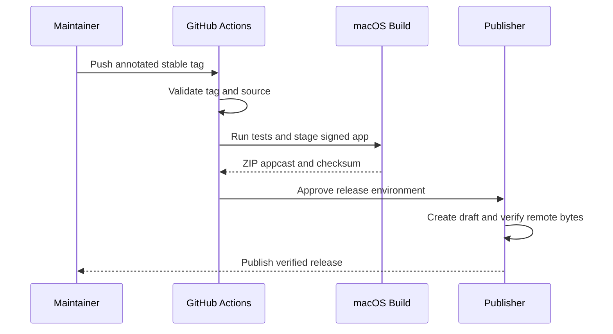

# Release Rsnap

Goal: Publish one stable Rsnap macOS release from an immutable tag.

Read this when: You are preparing a `vX.Y.Z` release or verifying its published assets.

Preconditions: `main` is clean and synced, the release version is committed, the Apple signing
secrets, the Rsnap repository Sparkle secret, and the `release` environment defined by
[`openwiki/spec/release-distribution.md`](../spec/release-distribution.md) are available, and a
logged-in macOS desktop session is available for smoke checks.

Depends on: [`openwiki/spec/release-distribution.md`](../spec/release-distribution.md); [`openwiki/spec/capture-session.md`](../spec/capture-session.md);
[`openwiki/spec/settings.md`](../spec/settings.md); [`openwiki/runbook/performance-validation.md`](./performance-validation.md)

Verification: The tag workflow succeeds, the three release assets validate, and the downloaded app
passes a minimal launch, update, capture, copy, and save check.

## Prepare

1. Confirm that `Cargo.toml` and local workspace packages in `Cargo.lock` use the intended `X.Y.Z`
   version.
2. Run the repository gates:

   ```sh
   cargo make checks
   cargo make test-host-reset
   cargo make test-macos-native-host-stage
   scripts/smoke/macos.sh
   scripts/perf/macos.sh
   scripts/smoke/sparkle-update-local.sh
   ```

3. Manually confirm permission recovery, normal and quick capture, edit/copy/save, OCR, scroll
   capture, Settings, and the About update controls. Use the governing specs and performance
   runbook for detailed assertions.

## Tag And Publish

The [Release Distribution Contract](../spec/release-distribution.md) governs this trust chain; this runbook supplies the operator sequence.



The sequence shows the tag-derived build and draft-first publication path implemented by `.github/workflows/release.yml`.

1. Create and push an annotated tag from the release commit on `origin/main`:

   ```sh
   git tag -a "v<version>" -m "Rsnap v<version>"
   git push origin "v<version>"
   ```

2. In the single `Release` workflow, wait for `Check source` and
   `Build macOS release` to succeed.
3. Approve the `release` environment. The publisher keeps the release as a draft until the exact
   ZIP, appcast, and checksum bytes pass remote verification.
4. For a transient service failure, rerun the unchanged workflow. For a source or build defect, fix
   `main` and release a new version. Never move or overwrite a published tag, and never manually
   publish a failed draft.

## Verify

1. Download these assets from the new GitHub release:
   - `rsnap-aarch64-apple-darwin.zip`
   - `appcast.xml`
   - `rsnap-aarch64-apple-darwin.zip.sha256`
2. Verify the checksum:

   ```sh
   shasum -a 256 -c rsnap-aarch64-apple-darwin.zip.sha256
   ```

3. Unzip the archive and verify the Apple signature:

   ```sh
   codesign --verify --deep --strict /path/to/Rsnap.app
   ```

4. Confirm that `appcast.xml` contains `sparkle:edSignature` and references the same tag and ZIP.
5. Launch the downloaded app and repeat the minimal user-flow check from the preparation step.
   Follow the trusted Gatekeeper override in `README.md` when macOS blocks this intentionally
   unnotarized Personal Team build.
