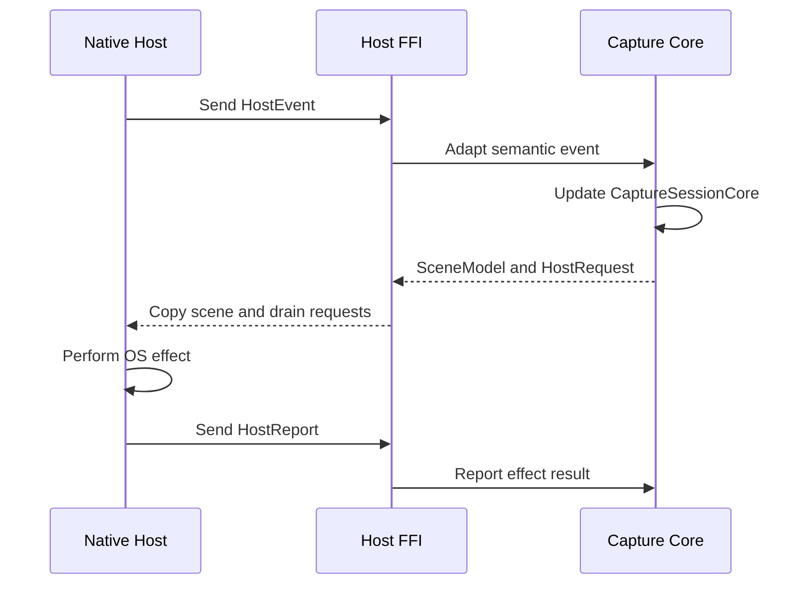

# Host/Core Protocol

Purpose: Define the canonical protocol surfaces that bridge native platform hosts and the Rust
product core.

Status: normative

Read this when: You are adding, reviewing, or migrating host/core boundary types, or when you need
the authoritative names of the new reset crates and protocol models.

Not this document: The overall ownership split or product-level capture behavior. Use
[`openwiki/spec/platform-host-boundary.md`](./platform-host-boundary.md) for ownership rules and [`openwiki/spec/capture-session.md`](./capture-session.md) for
product behavior.

Defines:
- the canonical reset crates for the host/core boundary
- the required semantic protocol types exposed by the Rust core
- the required ABI surface shape for native hosts

## Canonical reset crates

The active host/core reset uses these checked-in crates:

- `packages/rsnap-capture-core/`
- `packages/rsnap-host-ffi/`

`apps/rsnap/` remains a launcher/bootstrap container. It is not the durable source of truth for the
reset boundary.

## Rust product-core protocol

The protocol realizes the OS/product ownership split defined by the [Platform Host Boundary](./platform-host-boundary.md). The accepted [Native Host / Rust Core Reset](../decisions/native-host-rust-core-reset.md) explains why this explicit boundary replaced toolkit-owned OS semantics.

The sequence shows semantic events and reports crossing the thin ABI while OS effects stay native and product state stays in Rust.

`rsnap-capture-core` is the canonical home for portable product semantics used across hosts.

It must own the canonical Rust definitions for:

- `SessionConfig`
- `HostEvent`
- `HostRequest`
- `HostReport`
- `SceneModel`
- `CaptureSessionCore`
- shared geometric types such as `GlobalPoint`, `GlobalRect`, `RectPoints`, `MonitorRect`, and
  `WindowRect`

The live capture contract now also requires:

- `HostEvent::PointerMoved` to carry the current active monitor and highlighted window alongside
  pointer/RGB updates
- explicit primary-interaction events for `started`, `updated`, and `completed` so the Rust core
  owns live drag preview and freeze-target selection semantics
- `SceneModel.live_selection_preview` for the canonical live drag rectangle prior to frozen commit
- `HostRequest::RequestFreezeSnapshot.selection_editable` for the core-owned decision about
  whether the committed Frozen selection may be moved or resized after commit
- `SceneModel.active_monitor`, `SceneModel.highlighted_window`, and `SceneModel.cursor_intent` as
  the only semantic inputs the native host uses for live hover glow, live targeting cursor state,
  and frozen cursor mapping

`SceneModel.cursor_intent` describes product cursor semantics for the ordinary capture session. It
does not require the quick screenshot path to activate or focus an overlay just to receive cursor
rect updates. A native host quick screenshot acquisition path may hold temporary host-local cursor
ownership while armed or selecting, provided it preserves the product no-focus invariant in
[`openwiki/spec/capture-session.md`](./capture-session.md) and does not create durable product state outside the core protocol.

The host must not retain its own product-state copy of:

- pending frozen selection rectangles
- live drag preview rectangles
- whether the next frozen selection should be movable/resizable
- frozen resize-cursor hit testing

Those semantics belong to `rsnap-capture-core` and must cross the native boundary through
`SceneModel` / `HostEvent` / `HostRequest`, not through host-local shadow state. In particular,
native hosts must not infer Frozen editability from `SceneModel.live_selection_preview == selection`.
Only `HostRequest::RequestFreezeSnapshot.selection_editable` may decide whether the committed
Frozen selection can be moved or resized; click-targeted window/fullscreen selections must remain
fixed when that field is false.

The one allowed exception is transient host-local frozen transform presentation while a committed
selection is being interactively moved or resized after Frozen entry. In that case the native host may
hold a short-lived display snapshot, editability flag, and in-progress selection rect derived from
the last committed `SceneModel.frozen_selection`, but it must publish the committed rect back
through `HostReport::FreezeSnapshotCommitted` and must not invent a second durable product state for
window-selected frozen captures.

These types are semantic protocol models. They must not encode:

- `winit` window identifiers
- `egui` layout state
- AppKit objects or window handles
- platform-native event payloads beyond narrow host-owned adapter types

## Native-host ABI surface

`rsnap-host-ffi` is the canonical bridge for native hosts that do not call Rust directly.

The ABI layer must expose:

- an opaque `RsnapSessionHandle`
- an FFI-safe session config
- FFI-safe host event and host report payloads
- a copy-out scene snapshot
- a queue-drain entry point for host requests
- a checked-in C header at `packages/rsnap-host-ffi/include/rsnap_host_ffi.h`
- an explicit ABI version handshake, exposed both as `RSNAP_HOST_FFI_ABI_VERSION` and
  `rsnap_host_ffi_abi_version()`

The ABI surface must mirror the semantic models above, including:

- active monitor and highlighted window snapshots on pointer and primary-interaction events
- live selection preview rectangles on copied-out scene snapshots
- primary-interaction host events as distinct ABI event kinds
- frozen snapshot request editability as an explicit field on `RsnapHostRequestValue`

The ABI layer must stay thin:

- it mirrors semantic protocol values
- it does not become a second product model
- it does not own window, cursor, focus, IME, or capture logic

## Required ownership split

At the protocol boundary:

- native hosts own window lifecycle, activation, focus, cursor, IME, permissions, capture
  backends, and host-side effects
- `rsnap-capture-core` owns session state, geometry, targeting semantics, annotation/export
  semantics, and cursor intent

The host/core protocol must remain explicit. New work must not bypass it by teaching legacy
toolkit-owned paths to act as the authority for OS semantics.
